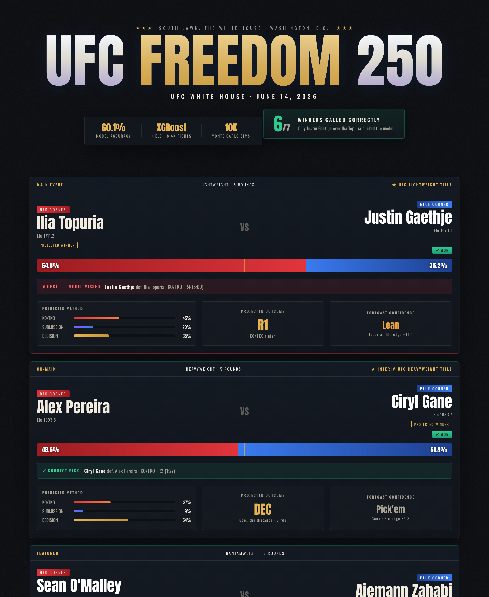

# 🥊 UFC Freedom 250 — ML Fight Predictions

Machine-learning predictions for **UFC Freedom 250** (the *UFC White House* card) —
June 14, 2026, South Lawn of the White House, Washington D.C.

Chess-style **Elo** + leakage-safe career features → a single **XGBoost** model →
method & round models → **10,000-simulation Monte Carlo** → an interactive dashboard.

**Live Dashboard:** [Click Here](https://bmvinay7.github.io/ufc-freedom250-prediction/)



---

## 🔮 The predictions

| Bout | Predicted winner | Win % | Confidence | Likely outcome |
|------|------------------|:-----:|------------|----------------|
| Lightweight 🏆 | **Ilia Topuria** | 64.8% | Lean | KO/TKO, R1 |
| Heavyweight 🏆 | **Ciryl Gane** | 51.4% | Pick'em | Decision (5 rds) |
| Bantamweight | **Sean O'Malley** | 78.1% | Heavy favorite | KO/TKO, R1 |
| Heavyweight | **Josh Hokit** | 80.2% | Heavy favorite | KO/TKO, R1 |
| Lightweight | **Maurício Ruffy** | 79.3% | Heavy favorite | Decision (3 rds) |
| Middleweight | **Bo Nickal** | 75.0% | Heavy favorite | Decision (3 rds) |
| Featherweight | **Diego Lopes** | 56.6% | Lean | Decision (3 rds) |

**Card outlook (10k Monte Carlo):** ~4.85 / 7 favorites expected to win · ~2 upsets ·
full-chalk only **6.9%** (a 7-leg parlay would pay ~14×).

> ⚠️ Analytical / entertainment use only. Not betting advice.

---

## 🧠 How it works

```
src/elo.py            chess Elo — pre-fight rating, post-fight update, finish-weighted K
src/features.py       ONE feature path (training + inference): leakage-safe rolling
                      pre-fight stats, physicals, form, layoff, differentials
src/build_dataset.py  data/raw/  ->  feature_matrix.csv + fighter_state.json
src/train.py          single XGBoost win model (+ baseline ref); method & round models
src/card.py           the 7 Freedom 250 fights (corners + tale-of-the-tape physicals)
src/predict.py        per-fight win % + method + round   ->  outputs/predictions.json
src/simulate.py       10k Monte Carlo: favorites-correct dist, chalk %, parlay, upsets
src/export_web.py     predictions.json  ->  docs/data.js
docs/                 static dashboard (open index.html, or serve via GitHub Pages)
```

**Why one model?** We benchmarked Dummy / Logistic Regression / Random Forest / XGBoost —
all land within ~1% accuracy. On this data the algorithm isn't the bottleneck, so we keep
**XGBoost** alone (best log-loss/Brier, native missing-value handling, nonlinear
interactions) and invest in features and leakage-safety instead.

**No leakage.** Every feature is computed *before* each fight — pre-fight Elo, and rolling
career stats accumulated strictly from prior bouts. In-fight stats are never used to
predict their own fight (the cardinal sin of MMA modelling).

---

## 📁 Project structure

```
ufc-freedom250/
├── data/
│   ├── raw/                  source data (committed)
│   │   ├── fights.csv        per-fight stats, both corners, 1994–2026
│   │   └── fighter_details.csv  static physicals (height/reach/stance/DOB)
│   └── (feature_matrix.csv, fighter_state.json — generated)
├── src/                      pipeline (see above)
├── models/                   trained artifacts (generated)
├── outputs/predictions.json  final predictions
├── docs/                     dashboard (index.html · styles.css · app.js · data.js)
├── run_all.sh                one-command end-to-end pipeline
└── requirements.txt
```

## 🚀 Run it

```bash
python3 -m venv .venv && source .venv/bin/activate
pip install -r requirements.txt
# macOS only: XGBoost needs the OpenMP runtime ->  brew install libomp
./run_all.sh
open docs/index.html
```

`run_all.sh` runs the full chain: build features → train → predict → simulate → export.

---

## 📊 Model performance

Temporal split (oldest 85% train, most-recent 15% test — never random):

| Metric | XGBoost | Always-pick-red baseline |
|--------|:-------:|:------------------------:|
| Accuracy | **0.60** | 0.55 |
| Log-loss | **0.666** | 0.710 |

UFC outcomes are genuinely hard to predict — a ~60% model is solid, and the log-loss
edge over baseline is where the real signal shows. Form, skill differentials and Elo
drive the picks; age is intentionally weighted below current form.

## 🙏 Data & credits

- Fight statistics & scorecards: [UFC-DataLab](https://github.com/komaksym/UFC-DataLab.git) and
  [ufcstats.com](http://www.ufcstats.com/).
- Card details: ufcstats.com / Wikipedia.
- Method inspired by a World-Cup-style prediction pipeline (Elo → features → model →
  Monte Carlo).

## 📄 License

MIT — see [LICENSE](LICENSE).
